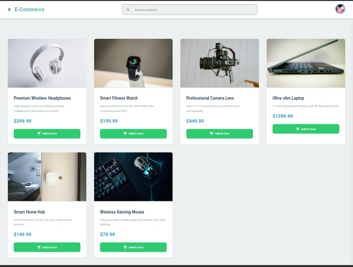

# E-Commerce Dashboard

## Overview

The E-Commerce Dashboard is a web application that allows users to browse products, manage a shopping cart, and view order details. It features a responsive design and a user-friendly interface making it easy for users to navigate and interact with the application.



## Features

- **Product Browsing**: Users can view a list of products with images, descriptions, and prices.
- **Shopping Cart Management**: Users can add products to their cart, view cart items, and proceed to checkout.
- **User Authentication**: Secure user login and profile management (to be implemented).
- **Responsive Design**: The application is designed to work on various screen sizes, including mobile devices.
- **Order History and Details**: Users can view their past orders and details (to be implemented).

## Technologies

- **HTML5**: For structuring the web pages.
- **CSS3**: For styling the application.
- **JavaScript (ES6+)**: For client-side interactivity.
- **Vue.js (2.x)**: For building the user interface and managing state.
- **Font Awesome**: For icons and visual elements.

## Getting Started

### Prerequisites

- Python 3.x or Node.js (if using the Node.js server)
- npm (if using Node.js)

### Installation

Clone the repository:

   ```bash
   git clone https://github.com/JohnDev19/E-commerce-Dashboard.git
   cd E-commerce-Dashboard
   ```

### Contributing
Contributions are welcome! If you have suggestions for improvements or new features, feel free to open an issue or submit a pull request.

### License
This project is licensed under the MIT License. See the [LICENSE](LICENSE) file for details.
